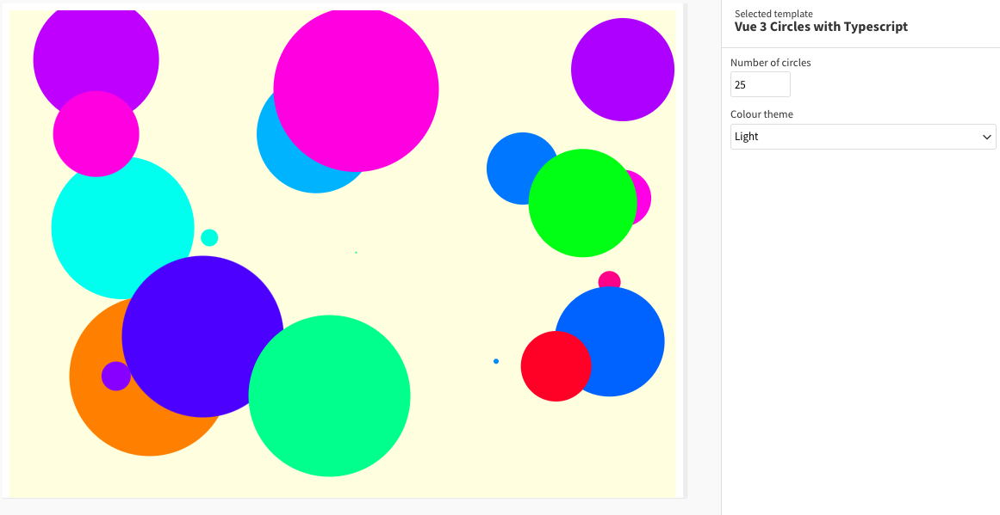

# Example Flourish template using [Vue 3](https://v3.vuejs.org/) with TypeScript

This simple example uses React to draw a specified number of colorful circles at random positions, radii & colors. It demonstrates the use of settings in a Vue context.

## How this works

- `template.yml` has settings for the number of circles and theme
- In `src/App.vue` an SVG is created with specified theme, drawing the specified number of circles with randomized positions, radii & colors
- `main.ts` sets up the data and state objects as well as the draw and update functions, all of which are required to run a Flourish template

## How to run this

- [Install Flourish](https://flourish.studio/developers/) and use `flourish run` to run the template
- More info about publishing a template to Flourish [can be found here](https://flourish.studio/developers/quickstart/publish-to-flourish/)